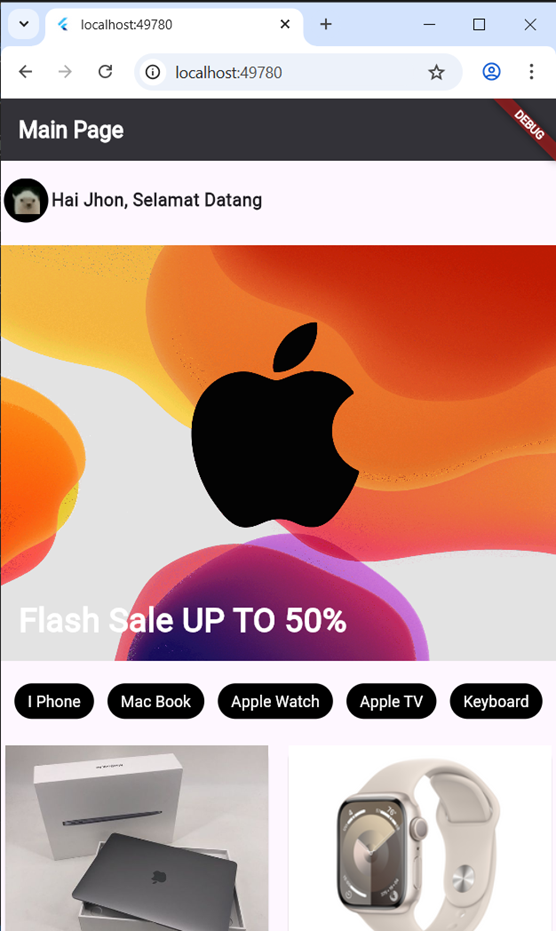

# Pertemuan 3 - E-Commerce UI App

Proyek ini adalah aplikasi Flutter sederhana yang menampilkan antarmuka halaman utama (Main Page) untuk sebuah toko elektronik atau aplikasi e-commerce.

## Fitur Utama
- **Header / Profil Pengguna**: Menampilkan foto profil avatar dan sapaan selamat datang kepada pengguna ("Hai Jhon, Selamat Datang") dengan tata letak yang tersusun rapi menggunakan `Flex`.
- **Banner Promosi**: Sebuah banner menarik yang menampilkan "Flash Sale UP TO 50%" di mana teks diletakkan di atas gambar menggunakan widget `Stack`.
- **Kategori Produk**: Terdapat daftar tombol kategori produk (I Phone, Mac Book, Apple Watch, Apple TV, Keyboard) yang mudah diakses.
- **Katalog Produk (Grid)**: Aplikasi menggunakan `GridView.count` dengan 2 kolom untuk menampilkan berbagai kartu produk yang memuat detail:
  - Gambar produk (Apple Watch, Keyboard, Earphone, dsb.)
  - Nama produk
  - Harga produk (di-mockup seharga 20.000.000)

## Struktur Direktori Utama
- `lib/main.dart`: Titik masuk utama (entry point) dari aplikasi ini. Semua kode UI untuk halaman utama ditulis dan diatur di dalam file ini dengan mengandalkan widget dasar Flutter seperti `Scaffold`, `SingleChildScrollView`, `Column`, `Row`, `Stack`, dan `GridView`.

## Prasyarat
- [Flutter SDK](https://docs.flutter.dev/get-started/install) versi 3.10.4 atau yang lebih baru.
- Editor teks atau IDE seperti VS Code atau Android Studio.

## Cara Menjalankan Aplikasi
1. Buka terminal atau command prompt.
2. Masuk ke direktori proyek ini:
   ```bash
   cd pertemuan3_2306082
   ```
3. Unduh semua dependensi paket (jika ada):
   ```bash
   flutter pub get
   ```
4. Jalankan aplikasi pada emulator atau perangkat yang terhubung:
   ```bash
   flutter run
   ```

## Teknologi yang Digunakan
- [Flutter](https://flutter.dev/) - Framework UI buatan Google.
- [Dart](https://dart.dev/) - Bahasa pemrograman yang digunakan oleh Flutter.


## Screenshot Aplikasi
